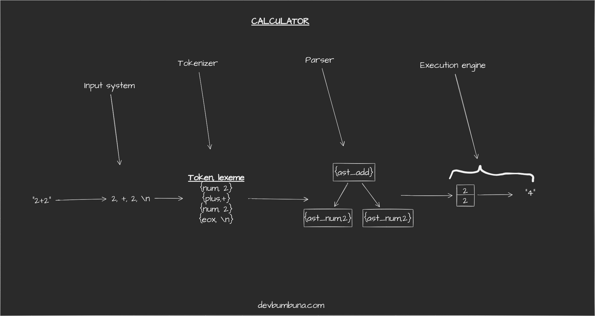

# Building and interpeter: A Calculator



A calculator working as an interpreter for arithmetic expressions.

## Building

Requires cmake 3.10+

```bash
$ git clone https://github.com/bumbuna/building-an-interpreter-a-calculator
$ cd building-an-interpreter-a-calculator
$ cmake --build build
```

## Testing

Requires ctest (part of cmake)

```bash
$ cd build
$ ctest
```

## Usage

This programm can be used in 3 separate ways:

```bash
$ tee | calculator  # pipe
$ calculator file_path
$ calculator    # repl
```

This project is part of the blog series [building-an-interpreter](https://devbumbuna.com/building-an-interpreter-a-calculator).
