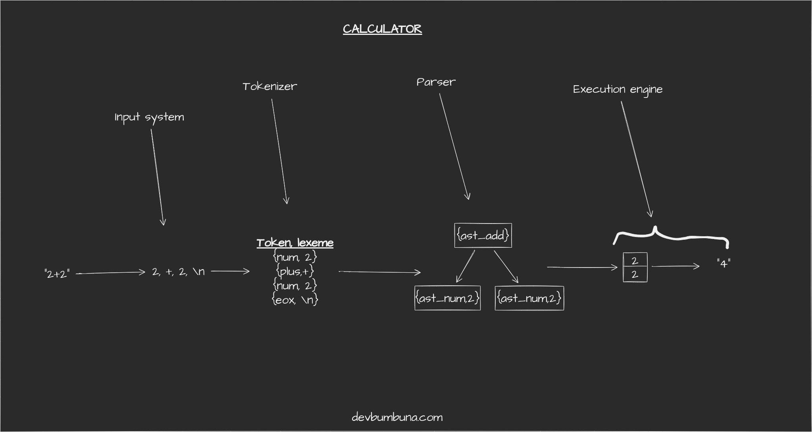

# Introduction to Interpreters: A repl Calculator



To get a full picture of how a language interpreter works we are going to build a simple arithmetic calculator that employs same procedures as an interpreter when evaluating arithmetic expressions.

### C Headers

```c
// Jacob Bumbuna <developer@devbumbuna.com>
// 2022
// no copyright

#include <ctype.h>  //isdigit, isspace
#include <fcntl.h>  //open, read
#include <stdio.h>  //fprintf, printf
#include <stdlib.h> //malloc, calloc
#include <string.h> //strndup, strlen
#include <unistd.h> //close
```

## The input system

This stage is the genesis of the interpretation process. It is responsible for the opening the source file(in our case a file containing arithmetic expressions on seperate lines) for reading. It also provides an interface to get a line from the open source file.

```C
/**
 * All functions return an integer indicating an error status
 * 0 - no error.
 * 1 - error occured and reported.
*/

#define SUCCESS 0
#define FAILURE 1
#define MAX_LINE_SIZE 1024

/* default to stdin */
int source_file_fd = STDIN_FILENO;
/* buffer for last line read */
char source_file_line[MAX_LINE_SIZE];
/* length in bytes of last line read */
int source_file_line_occupied_size = MAX_LINE_SIZE;
int source_file_line_position = MAX_LINE_SIZE;
/* eof flag */
int source_file_eof_read = 0;
/* line number of last line read */
int source_file_line_number = 0;

/**
 * open file at file_path for reading.
 * if file_path is NULL use stdin instead.
*/
int open_source_file(const char *file_path) {
    if(!file_path) {
        if(source_file_fd != STDIN_FILENO) {
            close(source_file_fd);
        }
        source_file_fd = STDIN_FILENO;
    } else {
        source_file_fd = open(file_path, O_RDONLY);
        int file_not_opened = source_file_fd == -1;
        if(file_not_opened) {
            perror("open");
            return FAILURE;
        }
    }
    return SUCCESS;
}

/**
 * get a line from the opened source file.
*/
int read_line() {
    static char c_buffer;
    static int show_prompt = 0;
    static int first_run = 1;
    int line_is_all_whitespaces = 1;
    if(first_run) {
        first_run = 0;
        /**
         * if opened source file is a terminal then show a prompt
        */
        if(isatty(source_file_fd)) {
            show_prompt = 1;
        }
    }
    source_file_line_occupied_size = 0;
    if(show_prompt) {
        printf("> ");
        fflush(stdout);
    }
    while(source_file_line_occupied_size < MAX_LINE_SIZE) {
        int c = read(source_file_fd, &c_buffer, 1);
        if(c == -1) {
            //error
            perror("read");
            return FAILURE;
        }
        source_file_line[source_file_line_occupied_size++] = c_buffer;
        if(c == 0) {
            //eof
            source_file_line[0] = -1;
            source_file_eof_read = 1;
            return SUCCESS;
        } else if(c_buffer == '\n') {
            source_file_line_number++;
            if(source_file_line_occupied_size == 1 || line_is_all_whitespaces) {
                //ignore blank and empty lines
                source_file_line_occupied_size = 0;
                /* reshow prompt */
                if(show_prompt) {
                    printf("> ");
                    fflush(stdout);
                }
                continue;
            }
            return SUCCESS;
        }
        if(line_is_all_whitespaces == 1 && !isspace(c_buffer)) {
            line_is_all_whitespaces = 0;
        }
    }
    //line too long
    return FAILURE;
}
```

## Lexical analysis stage
This stage is responsible for converting the source file into tokens. A **TOKEN** is the smallest unit of processing in a language.
Other responsibilities:
- discarding whitespaces.
- report invalid characters.

```C
typedef enum token_type {
    token_number,
    token_plus,
    token_minus,
    token_times,
    token_divide,
    token_bracket_open,
    token_bracket_close,
    token_end_of_expression,
    token_end_of_file
} token_type_e;

/* token structure, singly-linked list node*/
typedef struct token {
    /* token's type */
    enum token_type type;
    /* token's lexeme */
    char *lexeme;
    /* chain linker */
    struct token *next;
} token_t;

/* list structure */
typedef struct token_list {
    token_t *head;
    token_t *tail;
} token_list_t;
```

To separate this stage from the parsing stage the tokenizer builds tokens and adds them to a list where the parsing stage will read from.

```C
/* allocate memory space for new list*/
#define token_list_new() \
    calloc(1, sizeof(token_list_t))

/* add member to end of list */
#define token_list_append(list, member) \
do {\
    if(list->head == NULL) {\
        list->head = list->tail = member;\
    } else {\
        list->tail->next = member;\
        list->tail = member;\
    }\
} while(0);

/* de-allocate memory used by list and its members */
#define token_list_free(list) \
do {\
    token_t *t = list->head;\
    while(t != NULL) {\
        list->head = t->next;\
        free(t);\
        t = list->head;\
    }\
    free(list);\
} while(0);
/* allocate space memory for new token */
#define token_new() \
    calloc(1, sizeof(token_t))
```

```C
/**
 * extract tokens from a line read from the source file and 
 * add them to list.
*/
int tokenize_source_line_and_add_to_list(token_list_t *list) {
    char *current_character;
    int current_token_type;
    token_t *current_token;
    int lexeme_length = 1;
    for(int i = 0; i < source_file_line_occupied_size; i++) {
        current_character = &source_file_line[i];
        if(isspace(*current_character)) {
            /* skip whitespaces but not newline */
            if(*current_character != '\n') {
                continue;
            }
        }
        switch(*current_character) {
            case EOF : {
                current_token_type = token_end_of_file;
                break;
            }
            case '+': {
                current_token_type = token_plus;
                break;
            }
            case '-': {
                current_token_type = token_minus;
                break;
            }
            case '*': {
                current_token_type = token_times;
                break;
            }
            case '/': {
                current_token_type = token_divide;
                break;
            }
            case '(': {
                current_token_type = token_bracket_open;
                break;
            }
            case ')': {
                current_token_type = token_bracket_close;
                break;
            }
            case '\n': {
                current_token_type = token_end_of_expression;
                break;
            }
            default  : {
                if(!isdigit(*current_character)) {
                    /* report error */
                    fprintf(stderr, "Unexpected character.\n");
                    int snippet_start;
                    int snippet_end;
                    if(i > 5) {
                        snippet_start = i-5;
                    } else {
                        snippet_start = 0;
                    }
                    if((i+5) < source_file_line_occupied_size-1) {
                        snippet_end = i+5;
                    } else {
                        snippet_end = source_file_line_occupied_size-1;
                    }
                    fputc('\t', stderr);
                    for(int j = snippet_start; j < i; j++) {
                        fputc(source_file_line[j], stderr);
                    }
                    fprintf(stderr, "\033[1;31m%c\033[0m", *current_character);
                    for(int j = i+1; j < snippet_end; j++) {
                        fputc(source_file_line[j], stderr);
                    }
                    fputc('\n', stderr);
                    fputc('\t', stderr);
                    for(int j = snippet_start; j <= snippet_end; j++) {
                        if(j != i) {
                            fputc('~', stderr);
                        } else {
                            fputc('^', stderr);
                        }
                    }
                    fputc('\n', stderr);
                    fflush(stderr);
                    return FAILURE;
                }
                while(isdigit(source_file_line[++i])) {
                    lexeme_length++;
                }
                i--;
                current_token_type = token_number;
            }
        } //switch
        current_token = token_new();
        /* lexemes are neccessary only for numbers */
        if(current_token_type == token_number) {
            current_token->lexeme = strndup(current_character, lexeme_length);
        }
        current_token->type = current_token_type;
        token_list_append(list, current_token);
    }
    return SUCCESS;
}
```

The approach we have used here has the advantage that lexical errors are not propagated to the other stages of the interpreter.

## Syntax analysis stage

Every language has a set of rules that determine how "words" are arranged in a "sentence". These rules are collectively make up the `grammar` of the language and their enforcement determine the language's `syntax`.

Syntax analysis stage (or parser) enforces a grammar therefore a syntax on the source file tokens. Based off of how the parser works two families of parsers exist:
- bottom-up parsers.
- top-down parsers.

A quick google search on `types of parsers` will provide you with links to resources about these 2 types of parsers. We are going to implement a top-down parser here due to the following advantages over the bottom-up approach:
- Error reporting is easier and concise.
- Its easier to explain the code.
- It can be easily written without any parser generation tools.
- Employs widely known techniques i.e recursion.

Our parser builds an `abstract syntax tree` from the token stream. An `Abstract syntax tree` as the name suggests is a tree-like structure represeting the structure of the source code. This tree only stores the information/components essential to execution of the source code. Therefore constructs such as brackets do not appear anywhere on the AST.

```C
enum ast_type {
    ast_add,
    ast_sub,
    ast_div,
    ast_mul,
    ast_num
};

/* structure of an ast node */
typedef struct ast {
    enum ast_type type;
    union {
        /* used by internal node (operators)*/
        struct ast *children[2];
        /* used leaf nodes (operands)*/
        int value;
    };
} ast_t;

/* allocate memory space for a new ast node */
#define ast_new() \
    (calloc(1, sizeof(ast_t)))
/* convert string to integer */
#define str_to_int(str) \
    strtol(str, 0, 10)
```

```C
/**
 * token stream populated by the tokenizer stage.
 * 
*/
static token_list_t *parser_token_stream = NULL;
/**
 * pointer to the token that will be returned when
 * the parser requests a new one. 
*/
static token_t *parser_next_token = NULL;
/**
 * The last token to have been requested by the parser.
*/
static token_t *parser_active_token = NULL;

/**
 * set the stream of tokens to use. 
*/
int parser_register_token_stream(token_list_t *stream) {
    parser_token_stream = stream;
    if(stream != NULL) {
        parser_next_token = stream->head;
    }
    return SUCCESS;
}

/**
 * Get a token from the registered stream.
 * 
 * Parser routines don't have to know how to access the stream.
*/
token_t *parser_get_next_token() {
    if(parser_next_token != NULL) {
        parser_active_token = parser_next_token;
        parser_next_token = parser_next_token->next;
    }
    return parser_active_token;
}

/* compare a token's type to x */
#define token_type_is(x) \
    (parser_active_token->type == x)
```

The calculator grammar defined below enforces operator priority/precedence as stipulated by the BODMAS system.

```C
/**
 * Grammar's EBNF
 * 
 *  0. calculator           ->  arithmetic EOF
 *  1. arithmetic           ->  expression EOX
 *  2. expression           ->  add_expression
 *  3.                      |   EPSILON                       
 *  4. add_expression       ->  sub_expression add_expression_p
 *  5. add_expression_p     ->  ADD  sub_expression add_expression_p
 *  6.                      |   EPSILON
 *  7. sub_expression       ->  mul_expression sub_expression_p
 *  8. sub_expression_p     ->  SUB  mul_expression sub_expression_p
 *  9.                      |   EPSILON
 * 10. mul_expression       ->  div_expression mul_expression_p
 * 11. mul_expression_p     ->  MUL  div_expression mul_expression_p
 * 12.                      |   EPSILON
 * 13. div_expression       ->  unit_expression div_expression_p
 * 14. add_expression_p     ->  DIV  unit_expression div_expression_p
 * 15.                      |   EPSILON
 * 16. unit_expression      ->  NUMBER
 * 17.                      |   OPENBRACKET add_expression CLOSEBRACKET
*/
``` 

Implementing a grammar in code is actually quite easy, the `left-hand-side` of a production becomes the name of a subroutine and the `right-hand-side` makes up the body of the subroutine. `Terminal` symbols on the RHS are used to control conditional statements whereas the `non-terminal` symbols become call to subroutines implementing the LHS with the same name.

The code below has the following optimizations:
- prefer loops to recursion where applicable.

> **left-hand-side**: part of a production that appears before `->`

> **right-hand-side**: part of a production that appears after `->`

> **terminal**: symbol on the RHS that has no LHS with the same name. (become tokens) 

> **non-terminal**: symbol on the RHS that has an LHS with the same name.
```C
int parser_parse_add_expression(ast_t **tree);
int parser_parse_expression(ast_t **tree);
int parser_parse_sub_expression(ast_t **tree);
int parser_parse_mul_expression(ast_t **tree);
int parser_parse_div_expression(ast_t **tree);
int parser_parse_unit_expression(ast_t **tree);

/**
 * production 0
*/
int parse_token_stream_into_ast(token_list_t *stream, ast_t **tree) {
    int r = SUCCESS;
    parser_register_token_stream(stream);
    parser_get_next_token();
    /* no processing on eof */
    if(!token_type_is(token_end_of_file)) {
        r = parser_parse_expression(tree);
    }
    return r;
}

/**
 * Productions 1, 2 & 3
*/
int parser_parse_expression(ast_t **tree) {
    /* Our input system ignores blank and empty lines therefore the active token
    at this point cannot be of type EOX
    */
    int r = parser_parse_add_expression(tree);
    if(r == SUCCESS && !token_type_is(token_end_of_expression)) {
        fprintf(stderr, "\033[1;31mSyntaxError: Expected end of expression near %c.\033[0m\n", parser_active_token->lexeme[0]);
        r = FAILURE;
    }
    parser_get_next_token();
    return r;
}

/**
 * Productions 4, 5 & 6
*/
int parser_parse_add_expression(ast_t **tree) {
    int r = parser_parse_sub_expression(tree);
    while(token_type_is(token_plus) && r == SUCCESS) {
        parser_get_next_token();
        ast_t *new_ast = ast_new();
        new_ast->type = ast_add;
        new_ast->children[0] = *tree;
        if(parser_parse_sub_expression(&(new_ast->children[1])) == FAILURE) {
            r = FAILURE;
            break;
        }
        *tree = new_ast;
    }
    return r;
}

/**
 * Production 7, 8 & 9
*/
int parser_parse_sub_expression(ast_t **tree) {
    int r = parser_parse_mul_expression(tree);
    while(token_type_is(token_minus) && r == SUCCESS) {
        parser_get_next_token();
        ast_t *new_ast = ast_new();
        new_ast->type = ast_sub;
        new_ast->children[0] = *tree;
        if(parser_parse_mul_expression(&(new_ast->children[1])) == FAILURE) {
            r = FAILURE;
            break;
        }
        *tree = new_ast;
    }
    return r;
}

/**
 * production 10 , 11 & 12
*/
int parser_parse_mul_expression(ast_t **tree) {
    int r = parser_parse_div_expression(tree);
    while(token_type_is(token_times) && r == SUCCESS) {
        parser_get_next_token();
        ast_t *new_ast = ast_new();
        new_ast->type = ast_mul;
        new_ast->children[0] = *tree;
        if(parser_parse_div_expression(&(new_ast->children[1])) == FAILURE) {
            r = FAILURE;
            break;
        }
        *tree = new_ast;
    }
    return r;
}

/**
 * Production 13, 14 & 15
*/
int parser_parse_div_expression(ast_t **tree) {
    int r = parser_parse_unit_expression(tree);
    while(token_type_is(token_divide) && r == SUCCESS) {
        parser_get_next_token();
        ast_t *new_ast = ast_new();
        new_ast->type = ast_div;
        new_ast->children[0] = *tree;
        if(parser_parse_unit_expression(&(new_ast->children[1])) == FAILURE) {
            r = FAILURE;
            break;
        }
        *tree = new_ast;
    }
    return r;
}

/**
 * Production 16 & 17
*/
int parser_parse_unit_expression(ast_t **tree) {
    int r = SUCCESS;
    if(token_type_is(token_bracket_open)) {
        parser_get_next_token();
        r = parser_parse_add_expression(tree);
        if(r == FAILURE) {
            return FAILURE;
        }
        if(!token_type_is(token_bracket_close)) {
            /* bracket opened above does not have a matching closing bracket */
            fprintf(stderr, "\033[1;31mSyntaxError: Expected closing ) before end of expression.\033[0m\n");
            return FAILURE;
        }
    } else {
        /* at this point only NUM tokens are accepted */
        if(token_type_is(token_number)) {
            *tree = ast_new();
            (*tree)->type = ast_num;
            (*tree)->value = str_to_int(parser_active_token->lexeme);
        } else {
            fprintf(stderr, "\033[1;31mSyntaxError: Expected an integer or '(' near %c.\033[0m\n", parser_active_token->lexeme[0]);
            return FAILURE;
        }
    }
    parser_get_next_token();
    return r;
}
```

## The execution Engine 
This is the final stage of interpretation. Output is generated by this stage, in our case the output is the result of given arithmetic calculations.

Execution is done by doing a `depth-first traversal` of the AST. During traversal leaf nodes(operands) have their integer values pushed into a stack while internal nodes(operators) trigger 2 pops on the stack, perform the desired operation on the poped values then push the result back to the stack.


The parser stage has effectively guaranteed that the AST used by this stage is valid, therefore only runtime errors can be encountered at this stage.

```C
/** stack creation and manipulation procedures */
#define MAX_CALLSTACK_DEPTH 32
/* the stack */
int callstack[MAX_CALLSTACK_DEPTH];
/* the top the stack (downward growing stack) */
int callstack_top = MAX_CALLSTACK_DEPTH;

#define callstack_push(x) \
    (callstack[--callstack_top] = x)

#define callstack_pop() \
    (callstack[callstack_top++])

#define callstack_is_full() \
    (callstack_top == 0)

#define callstack_is_empty() \
    (callstack_top == MAX_CALLSTACK_DEPTH)

#define callstack_clear() \
    (callstack_top = MAX_CALLSTACK_DEPTH)
```

```C
/**
 * perform an operation on the two topmost stack elements and
 * push the result back to the stack.
*/
int execution_engine_do_operation(enum ast_type operator) {
    int right_operand = callstack_pop();
    int left_operand = callstack_pop();
    switch(operator) {
        case ast_add: {
            left_operand += right_operand;
            break;
        }
        case ast_sub: {
            left_operand -= right_operand;
            break;
        }
        case ast_mul: {
            left_operand *= right_operand;
            break;
        }
        case ast_div: {
            if(right_operand == 0) {
                fprintf(stderr, "\033[1;31mRuntimeError: Division by Zero\033[0m.\n");
                return FAILURE;
            }
            left_operand /= right_operand;
            break;
        }
    }
    callstack_push(left_operand);
    return SUCCESS;
}

/**
 * Do a depth first traversal of the AST tree rooted at node. 
*/
int execution_engine_process_ast_node(ast_t *node) {
    if(node != NULL) {
        switch(node->type) {
            case ast_num: {
                if(callstack_is_full()) {
                    /* expression is too nested */
                    fprintf(stderr, "\033[1;31mRuntimeError: StackOverflow\033[0m.\n");
                    return FAILURE;
                }
                callstack_push(node->value);
                break;
            }
            default: {
                int status = execution_engine_process_ast_node(node->children[0]);
                if(status != SUCCESS) {
                    return FAILURE;
                }
                status = execution_engine_process_ast_node(node->children[1]);
                if(status != SUCCESS) {
                    return FAILURE;
                }
                if(execution_engine_do_operation(node->type) == FAILURE) {
                    return FAILURE;
                }
            }
        }
    }
    return SUCCESS;
}

/**
 * Begin the execution of AST tree.
 * 
 * When the xecution is done there should be a single element at the top
 * of the callstack which is the result of calculations.
*/
int execution_engine(ast_t *tree) {
    int status = SUCCESS;
    if(tree != NULL) {
        status = execution_engine_process_ast_node(tree);
        if(status == SUCCESS) {
            if(callstack_is_empty()) {
                /* Things have gone really wrong !!!*/
                fprintf(stderr, "\033[1;31mRuntimeError: StackUnderflow\033[0m.\n");
                return FAILURE;
            }
            printf("\033[1;32m%d\033[0m.\n", callstack_pop());
        }
    }
    callstack_clear();
    return status;
}
```

## Bringing it all together

```C
/**
 * Tying it all together.
*/
int main(int argc, char **argv) {
    int return_code = SUCCESS;
    char *source_file_path = argc == 2 ? argv[1] : NULL;
    if(open_source_file(source_file_path) != SUCCESS) {
        return EXIT_FAILURE;
    }
    if(isatty(source_file_fd)) {
        printf("A BODMAS calculator.\n"
                "Version 1.0.\n"
                "https://devbumbuna.com/building-an-interpreter-a-repl-calculator.\n");
    }
    while(source_file_eof_read == 0) {
        token_list_t *stream = token_list_new();
        if(read_line() == FAILURE) {
            break;
        }
        if(tokenize_source_line_and_add_to_list(stream) == FAILURE) {
            return_code = FAILURE;
            continue;
        }
        ast_t *tree = NULL;
        if(parse_token_stream_into_ast(stream, &tree) == SUCCESS) {
            execution_engine(tree);
            token_list_free(stream);
        } else {
            return_code = FAILURE;
        }
    }
    printf("\n");
    return return_code;
}
```


## Conclusion

The code implemented above works as intended. There are still several optimizations and refactoring that can be done on the code to make it easier to read/maintain and efficient. I sincerely hope that you have gained some basic insight into the workings of language interpreters.

## Resources

The source code is hosted on [github](https://github.com/bumbuna/building-an-interpreter-a-repl-calculator). 